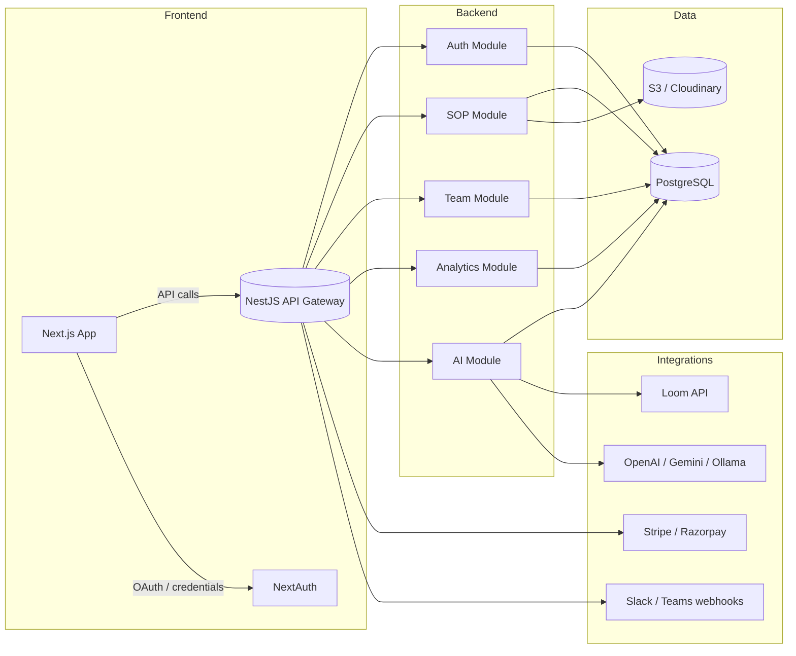

# Architecture

## Overview

KiriGen TeamSOP AI is a multi-tenant SaaS platform, split into a
Next.js frontend and a NestJS API, sharing a single PostgreSQL database
via Prisma. It's organized as a pnpm + Turborepo monorepo so the
frontend, backend, and shared packages can be built/tested/deployed
independently while sharing types and utilities.

## Why these choices

- **Next.js (frontend)** — SSR for the marketing/landing pages, CSR for
  the authenticated app, built-in routing and API routes for thin
  proxying to the NestJS backend.
- **NestJS (backend)** — module boundaries (auth/sop/team/analytics/ai)
  map directly onto the feature list, dependency injection makes the
  AI provider swappable (OpenAI ↔ Ollama) without touching callers.
- **PostgreSQL + Prisma** — SOPs, teams, and permissions are relational
  by nature (a SOP belongs to a team, a team belongs to an org, a user
  has roles per team); Prisma gives type-safe queries and migrations.
- **Multi-tenancy model** — shared schema, tenant-scoped by
  `Organization → Team → TeamMember`, rather than database-per-tenant.
  Cheaper to run at small/medium scale; revisit database-per-tenant
  only if a large enterprise customer requires hard data isolation.

## Request flow: "Generate a SOP from a Loom transcript"

1. User pastes a Loom URL (or raw transcript) in `apps/web/pages/sops/new.tsx`.
2. Frontend calls `POST /api/backend/sops/generate` (proxied to the NestJS API).
3. `SopController.generate` → `SopService.generate`.
4. If a Loom URL was given, `AiService.fetchLoomTranscript` calls the
   Loom API (`LoomProvider`) to pull the transcript text.
5. `AiService.generateDocument` calls the configured LLM provider
   (`OpenAiProvider` or `OllamaProvider`, chosen via `AI_DEFAULT_PROVIDER`)
   with a prompt built from `packages/ai`'s shared templates.
6. The returned Markdown is persisted as a new `SOP` row with
   `status: DRAFT`, `sourceType: LOOM_TRANSCRIPT`.
7. Frontend redirects to `/sops/[id]` and renders the Markdown.

## Open design decisions / things a real build-out still needs

- **Real-time collaboration** (inline co-editing, comments) — would
  need a CRDT layer (e.g. Yjs) and a websocket gateway; not scaffolded
  here beyond the `Comment` model.
- **Workflow builder UI** (drag-drop BPMN) — the `Workflow` model
  stores an arbitrary JSON graph; no canvas editor is scaffolded yet.
  Consider `react-flow`.
- **File OCR / DOCX/PDF import** — `SOP.sourceType: UPLOADED_DOC` and
  an S3 upload flow are modeled, but text-extraction (e.g. via
  `pdf-parse`, `mammoth` for docx, or an OCR service) isn't wired up.
- **Billing webhooks** — `Subscription` model exists; Stripe/Razorpay
  webhook handlers to keep `status`/`currentPeriodEnd` in sync are not
  scaffolded.
