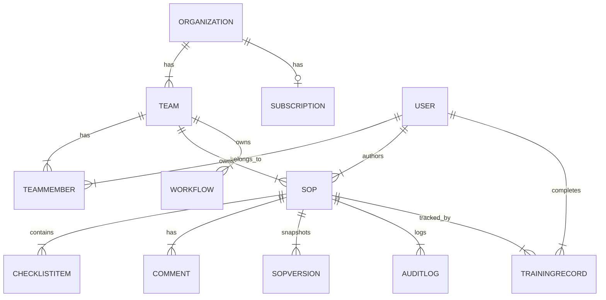

# Entity-Relationship Diagram

See `prisma/schema.prisma` for the source of truth. Summary:

Notes:

- `TeamMember` is the join table carrying `role` (ADMIN/EDITOR/REVIEWER/VIEWER) — this is where per-team permissions live.
- `SopVersion` is an immutable snapshot written on approve/publish, so a SOP's live `content` can keep changing without losing history.
- `AuditLog` is intentionally generic (`action: string` + `metadata: Json`) so new event types don't require a migration.
